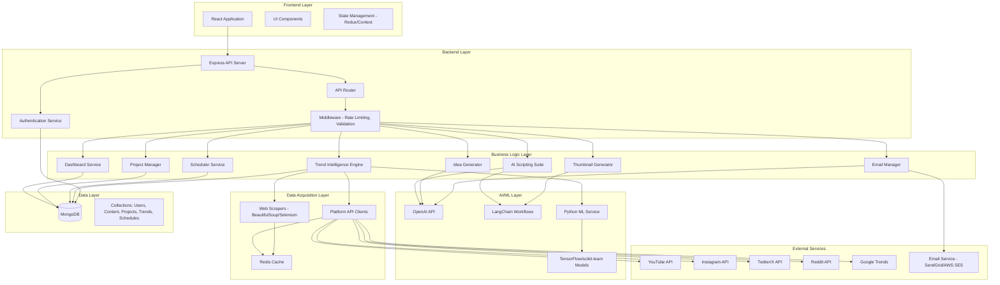

# Design Document: GenAI Content Creation Application

## Overview

The GenAI Content Creation Application is a full-stack web application built on the MERN stack (MongoDB, Express, React, Node.js) that provides content creators with AI-powered tools for multi-platform social media management. The system architecture follows a microservices-inspired modular design with clear separation between frontend presentation, backend business logic, AI/ML processing, and data acquisition layers.

The application integrates multiple AI models (OpenAI GPT, LangChain workflows, TensorFlow/scikit-learn for trend analysis) with real-time data from social media platforms to deliver intelligent content creation, trend analysis, and workflow automation capabilities.

### Key Design Principles

1. **Modularity**: Each major feature (Dashboard, Trend Intelligence, AI Scripting, etc.) is implemented as a distinct module with well-defined interfaces
2. **Scalability**: Stateless backend services with MongoDB for horizontal scaling
3. **Real-time Responsiveness**: WebSocket connections for live updates and streaming AI responses
4. **Security-First**: Encrypted credential storage, secure session management, rate limiting
5. **Fault Tolerance**: Graceful degradation when external APIs fail, retry mechanisms, comprehensive error handling
6. **Caching Strategy**: Multi-layer caching (Redis for API responses, browser cache for static assets) to minimize latency and API costs

## Architecture

### System Architecture Diagram



### Technology Stack

**Frontend:**
- React 18+ with functional components and hooks
- State management: Redux Toolkit or React Context API
- UI framework: Material-UI or Tailwind CSS
- Real-time updates: Socket.io-client
- HTTP client: Axios with interceptors

**Backend:**
- Node.js 18+ with Express.js
- Authentication: JWT with refresh tokens
- Session management: express-session with MongoDB store
- WebSocket: Socket.io for real-time features
- Validation: Joi or express-validator
- Rate limiting: express-rate-limit

**Database:**
- MongoDB 6+ with Mongoose ODM
- Indexes on frequently queried fields (userId, projectId, timestamp)
- TTL indexes for temporary data (cache, sessions)

**AI/ML:**
- OpenAI API (GPT-4 for content generation)
- LangChain for complex AI workflows
- Python microservice for ML models (FastAPI)
- TensorFlow/Keras for trend prediction
- scikit-learn for clustering and classification
- pandas/NumPy for data processing

**Data Acquisition:**
- Official APIs: youtube-data-api, snoowrap (Reddit), twitter-api-v2
- Web scraping: BeautifulSoup4, Selenium WebDriver
- Proxy rotation for scraping resilience
- Redis for caching API responses (10-15 minute TTL)

**DevOps:**
- Version control: Git/GitHub
- CI/CD: GitHub Actions
- Containerization: Docker
- Cloud hosting: AWS (EC2, S3, Lambda) or Google Cloud Platform
- Monitoring: PM2, CloudWatch, or Datadog

## Components and Interfaces

### 1. Frontend Components

#### Dashboard Component
```typescript
interface DashboardProps {
  userId: string;
}

interface PlatformConnection {
  platform: 'instagram' | 'youtube' | 'twitter' | 'threads';
  connected: boolean;
  lastSync: Date;
  metrics?: {
    followers: number;
    engagement: number;
    recentPosts: number;
  };
}

interface DashboardState {
  connections: PlatformConnection[];
  loading: boolean;
  error: string | null;
}

// Main dashboard component that aggregates all platform data
const Dashboard: React.FC<DashboardProps>
```

#### Trend Intelligence Component
```typescript
interface TrendData {
  platform: string;
  hashtags: Array<{ tag: string; volume: number; growth: number }>;
  keywords: Array<{ keyword: string; searchVolume: number }>;
  viralContent: Array<{
    type: 'song' | 'meme' | 'format';
    title: string;
    engagement: number;
    url?: string;
  }>;
  lastUpdated: Date;
}

interface TrendIntelligenceProps {
  platforms: string[];
  refreshInterval?: number; // milliseconds
}

const TrendIntelligence: React.FC<TrendIntelligenceProps>
```

#### AI Content Generator Component
```typescript
interface ContentGenerationRequest {
  type: 'youtube_video' | 'youtube_short' | 'blog';
  topic: string;
  keywords?: string[];
  includeSources?: boolean;
  tone?: 'professional' | 'casual' | 'energetic' | 'educational';
  length?: 'short' | 'medium' | 'long';
}

interface GeneratedContent {
  script: string;
  description?: string;
  sources?: string[];
  metadata: {
    wordCount: number;
    estimatedDuration?: number;
    generatedAt: Date;
  };
}

const AIContentGenerator: React.FC
```

#### Scheduler Component
```typescript
interface ScheduledPost {
  id: string;
  platform: string;
  content: string;
  scheduledTime: Date;
  status: 'pending' | 'posted' | 'failed';
  projectId?: string;
}

interface CalendarEvent {
  date: Date;
  posts: ScheduledPost[];
  optimalTimes?: Date[];
}

const ContentScheduler: React.FC
```

### 2. Backend API Endpoints

#### Authentication & User Management
```typescript
POST   /api/auth/register
POST   /api/auth/login
POST   /api/auth/logout
POST   /api/auth/refresh-token
GET    /api/auth/me

POST   /api/platforms/connect/:platform
DELETE /api/platforms/disconnect/:platform
GET    /api/platforms/status
```

#### Dashboard & Analytics
```typescript
GET    /api/dashboard/overview
GET    /api/dashboard/platforms
GET    /api/dashboard/metrics/:platform
POST   /api/dashboard/sync/:platform
```

#### Trend Intelligence
```typescript
GET    /api/trends/hashtags?platforms=youtube,instagram
GET    /api/trends/keywords?platform=youtube
GET    /api/trends/viral-content?type=songs,memes
GET    /api/trends/recommendations?niche=tech
POST   /api/trends/refresh
```

#### AI Content Generation
```typescript
POST   /api/ai/generate-script
POST   /api/ai/generate-title
POST   /api/ai/generate-description
POST   /api/ai/generate-ideas
GET    /api/ai/generation-history
```

#### Scheduling
```typescript
GET    /api/schedule/calendar?month=2024-01
POST   /api/schedule/create
PUT    /api/schedule/:id
DELETE /api/schedule/:id
GET    /api/schedule/optimal-times?platform=youtube
```

#### Project Management
```typescript
GET    /api/projects
POST   /api/projects/create
GET    /api/projects/:id
PUT    /api/projects/:id
DELETE /api/projects/:id
GET    /api/projects/:id/content
POST   /api/projects/:id/content
GET    /api/content/search?query=keyword&project=id
```

#### Email Management
```typescript
POST   /api/email/generate
POST   /api/email/send
GET    /api/email/templates
POST   /api/email/templates/create
GET    /api/email/history
```

### 3. Backend Services

#### Authentication Service
```typescript
interface AuthService {
  register(email: string, password: string, name: string): Promise<User>;
  login(email: string, password: string): Promise<{ user: User; token: string; refreshToken: string }>;
  verifyToken(token: string): Promise<User>;
  refreshAccessToken(refreshToken: string): Promise<string>;
  logout(userId: string): Promise<void>;
}
```

#### Dashboard Service
```typescript
interface PlatformCredentials {
  platform: string;
  accessToken: string;
  refreshToken?: string;
  expiresAt?: Date;
}

interface DashboardService {
  connectPlatform(userId: string, platform: string, credentials: PlatformCredentials): Promise<void>;
  disconnectPlatform(userId: string, platform: string): Promise<void>;
  getPlatformData(userId: string, platform: string): Promise<PlatformConnection>;
  syncAllPlatforms(userId: string): Promise<PlatformConnection[]>;
  getOverview(userId: string): Promise<DashboardState>;
}
```

#### Trend Intelligence Engine
```typescript
interface TrendQuery {
  platforms: string[];
  dataTypes: Array<'hashtags' | 'keywords' | 'viral_content'>;
  timeRange?: 'hour' | 'day' | 'week';
}

interface TrendIntelligenceEngine {
  fetchTrends(query: TrendQuery): Promise<TrendData[]>;
  analyzeEngagement(platform: string, content: any): Promise<number>;
  predictTrending(historicalData: any[]): Promise<string[]>;
  cacheResults(key: string, data: any, ttl: number): Promise<void>;
  getCachedResults(key: string): Promise<any | null>;
}
```

#### AI Scripting Suite
```typescript
interface ScriptGenerationOptions {
  type: 'youtube_video' | 'youtube_short' | 'blog';
  topic: string;
  keywords?: string[];
  tone?: string;
  length?: string;
  includeSources?: boolean;
}

interface AIScriptingSuite {
  generateScript(options: ScriptGenerationOptions): Promise<GeneratedContent>;
  generateDescription(script: string, includeSources: boolean): Promise<string>;
  improveScript(script: string, feedback: string): Promise<string>;
  saveToHistory(userId: string, content: GeneratedContent, projectId?: string): Promise<string>;
}
```

#### Thumbnail Generator
```typescript
interface TitleGenerationOptions {
  topic: string;
  platform: string;
  niche?: string;
  targetAudience?: string;
}

interface ThumbnailGenerator {
  generateTitles(options: TitleGenerationOptions): Promise<string[]>;
  generateCaptions(content: string, platform: string): Promise<string>;
  getVisualInspiration(topic: string, platform: string): Promise<Array<{ url: string; style: string }>>;
  analyzeCTR(title: string, niche: string): Promise<number>;
}
```

#### Scheduler Service
```typescript
interface ScheduleOptions {
  userId: string;
  platform: string;
  content: string;
  scheduledTime: Date;
  projectId?: string;
}

interface SchedulerService {
  createSchedule(options: ScheduleOptions): Promise<ScheduledPost>;
  updateSchedule(scheduleId: string, updates: Partial<ScheduleOptions>): Promise<ScheduledPost>;
  deleteSchedule(scheduleId: string): Promise<void>;
  getCalendar(userId: string, month: string): Promise<CalendarEvent[]>;
  getOptimalTimes(userId: string, platform: string): Promise<Date[]>;
  executeScheduledPost(scheduleId: string): Promise<void>;
}
```

#### Idea Generator
```typescript
interface IdeaGenerationOptions {
  userId: string;
  niche?: string;
  platforms?: string[];
  count?: number;
}

interface ContentIdea {
  title: string;
  description: string;
  hook: string;
  keywords: string[];
  trendScore: number;
}

interface IdeaGenerator {
  generateIdeas(options: IdeaGenerationOptions): Promise<ContentIdea[]>;
  refineIdea(idea: ContentIdea, feedback: string): Promise<ContentIdea>;
  scoreIdea(idea: ContentIdea, trendData: TrendData): Promise<number>;
}
```

#### Email Manager
```typescript
interface EmailGenerationOptions {
  purpose: 'collaboration' | 'sponsorship' | 'fan_response' | 'custom';
  context: string;
  recipientInfo?: any;
  tone?: string;
}

interface EmailManager {
  generateEmail(options: EmailGenerationOptions): Promise<string>;
  modifyEmail(emailContent: string, modifications: string): Promise<string>;
  sendEmail(to: string, subject: string, body: string, userId: string): Promise<void>;
  saveTemplate(userId: string, name: string, template: string): Promise<string>;
  getTemplates(userId: string): Promise<Array<{ id: string; name: string; template: string }>>;
  logSentEmail(userId: string, to: string, subject: string, timestamp: Date): Promise<void>;
}
```

#### Project Manager
```typescript
interface Project {
  id: string;
  userId: string;
  name: string;
  platform?: string;
  description?: string;
  createdAt: Date;
  updatedAt: Date;
}

interface ContentItem {
  id: string;
  projectId: string;
  userId: string;
  type: 'script' | 'title' | 'idea' | 'email';
  content: string;
  metadata: any;
  createdAt: Date;
}

interface ProjectManager {
  createProject(userId: string, name: string, platform?: string, description?: string): Promise<Project>;
  getProject(projectId: string): Promise<Project>;
  updateProject(projectId: string, updates: Partial<Project>): Promise<Project>;
  deleteProject(projectId: string): Promise<void>;
  listProjects(userId: string): Promise<Project[]>;
  addContent(projectId: string, content: ContentItem): Promise<string>;
  getProjectContent(projectId: string): Promise<ContentItem[]>;
  searchContent(userId: string, query: string, filters?: any): Promise<ContentItem[]>;
}
```

### 4. Data Acquisition Layer

#### Platform API Client
```typescript
interface APIClient {
  platform: string;
  authenticate(credentials: any): Promise<void>;
  fetchData(endpoint: string, params?: any): Promise<any>;
  handleRateLimit(): Promise<void>;
  refreshToken(): Promise<void>;
}

class YouTubeAPIClient implements APIClient {
  async getTrendingVideos(region: string, category?: string): Promise<any[]>;
  async searchVideos(query: string, maxResults: number): Promise<any[]>;
  async getVideoStats(videoId: string): Promise<any>;
}

class RedditAPIClient implements APIClient {
  async getTrendingSubreddits(): Promise<any[]>;
  async getHotPosts(subreddit: string, limit: number): Promise<any[]>;
  async searchPosts(query: string, subreddit?: string): Promise<any[]>;
}

class TwitterAPIClient implements APIClient {
  async getTrendingTopics(location?: string): Promise<any[]>;
  async searchTweets(query: string, maxResults: number): Promise<any[]>;
}
```

#### Web Scraper
```typescript
interface ScraperConfig {
  url: string;
  selectors: Record<string, string>;
  waitForSelector?: string;
  useJavaScript?: boolean;
}

interface WebScraper {
  scrape(config: ScraperConfig): Promise<any>;
  scrapeWithSelenium(config: ScraperConfig): Promise<any>;
  respectRobotsTxt(url: string): Promise<boolean>;
  delay(ms: number): Promise<void>;
}
```

### 5. AI/ML Integration

#### OpenAI Integration
```typescript
interface OpenAIService {
  generateCompletion(prompt: string, options?: {
    model?: string;
    temperature?: number;
    maxTokens?: number;
  }): Promise<string>;
  
  generateChatCompletion(messages: Array<{ role: string; content: string }>, options?: any): Promise<string>;
  
  streamCompletion(prompt: string, onChunk: (chunk: string) => void): Promise<void>;
}
```

#### LangChain Workflows
```typescript
interface LangChainWorkflow {
  name: string;
  steps: Array<{
    action: string;
    prompt: string;
    parser?: (output: string) => any;
  }>;
}

interface LangChainService {
  executeWorkflow(workflow: LangChainWorkflow, input: any): Promise<any>;
  createChain(steps: any[]): any;
  addMemory(chain: any, memoryType: 'buffer' | 'summary'): any;
}
```

#### Python ML Service (FastAPI)
```python
from fastapi import FastAPI
from pydantic import BaseModel
from typing import List, Dict

class TrendAnalysisRequest(BaseModel):
    platform: str
    data: List[Dict]
    analysis_type: str  # 'predict', 'cluster', 'classify'

class TrendAnalysisResponse(BaseModel):
    predictions: List[str]
    confidence: float
    insights: Dict

@app.post("/analyze-trends")
async def analyze_trends(request: TrendAnalysisRequest) -> TrendAnalysisResponse:
    # Use TensorFlow/scikit-learn models
    pass

@app.post("/predict-engagement")
async def predict_engagement(content: str, platform: str) -> float:
    # ML model prediction
    pass
```

## Data Models

### User Model
```typescript
interface User {
  _id: ObjectId;
  email: string;
  passwordHash: string;
  name: string;
  platformConnections: Array<{
    platform: string;
    accessToken: string;  // Encrypted
    refreshToken?: string;  // Encrypted
    expiresAt?: Date;
    connectedAt: Date;
  }>;
  preferences: {
    defaultPlatform?: string;
    timezone: string;
    emailNotifications: boolean;
  };
  subscription: {
    tier: 'free' | 'pro' | 'enterprise';
    expiresAt?: Date;
  };
  createdAt: Date;
  updatedAt: Date;
}
```

### Project Model
```typescript
interface Project {
  _id: ObjectId;
  userId: ObjectId;
  name: string;
  platform?: 'youtube' | 'instagram' | 'twitter' | 'threads' | 'general';
  description?: string;
  tags: string[];
  createdAt: Date;
  updatedAt: Date;
}
```

### Content Model
```typescript
interface Content {
  _id: ObjectId;
  userId: ObjectId;
  projectId?: ObjectId;
  type: 'script' | 'title' | 'description' | 'idea' | 'email';
  content: string;
  metadata: {
    platform?: string;
    keywords?: string[];
    tone?: string;
    wordCount?: number;
    sources?: string[];
  };
  createdAt: Date;
  updatedAt: Date;
}
```

### Schedule Model
```typescript
interface Schedule {
  _id: ObjectId;
  userId: ObjectId;
  projectId?: ObjectId;
  platform: string;
  contentId?: ObjectId;
  contentText: string;
  scheduledTime: Date;
  status: 'pending' | 'posted' | 'failed' | 'cancelled';
  postedAt?: Date;
  error?: string;
  createdAt: Date;
  updatedAt: Date;
}
```

### Trend Cache Model
```typescript
interface TrendCache {
  _id: ObjectId;
  platform: string;
  dataType: 'hashtags' | 'keywords' | 'viral_content';
  data: any;
  createdAt: Date;
  expiresAt: Date;  // TTL index
}
```

### Email Log Model
```typescript
interface EmailLog {
  _id: ObjectId;
  userId: ObjectId;
  to: string;
  subject: string;
  body: string;
  status: 'sent' | 'failed';
  sentAt: Date;
  error?: string;
}
```

### Email Template Model
```typescript
interface EmailTemplate {
  _id: ObjectId;
  userId: ObjectId;
  name: string;
  purpose: string;
  template: string;
  variables: string[];
  createdAt: Date;
  updatedAt: Date;
}
```

## Correctness Properties

*A property is a characteristic or behavior that should hold true across all valid executions of a system—essentially, a formal statement about what the system should do. Properties serve as the bridge between human-readable specifications and machine-verifiable correctness guarantees.*


### Property Reflection

After analyzing all acceptance criteria, I've identified the following consolidation opportunities:

**Consolidations:**
1. Multiple persistence tests (3.5, 5.3, 7.3, 8.1, 8.5) can be consolidated into a general "data persistence with required fields" property
2. Multiple "response structure validation" tests (2.1, 2.2, 2.3, 4.3, 6.5) can be consolidated into properties that verify API responses contain required fields
3. Multiple "error handling continues operation" tests (1.3, 2.7) share the same pattern of partial failure resilience
4. Multiple "filtering/sorting" tests (2.6, 8.3, 8.7) test similar data transformation behaviors

**Redundancies Eliminated:**
- 8.5 is redundant with the general persistence pattern already tested in 3.5 and 5.3
- 2.1 and 2.2 can be combined into a single property about trend data structure
- 11.1 and 12.1, 12.2, 12.6 all test "which service is called" which is implementation detail, not behavior

**Unique Properties Retained:**
- Round-trip properties (10.2 for encryption, 8.6 for markdown)
- Quantity guarantees (4.2 for title count, 6.1 for idea count)
- Behavioral properties (1.4 for cleanup, 11.3 for queueing, 12.3 for retry logic)
- Integration properties (6.2 for trend keyword integration, 6.3 for personalization)

### Correctness Properties

Property 1: Credential Encryption Round-Trip
*For any* set of platform credentials, encrypting then decrypting should produce credentials equivalent to the original
**Validates: Requirements 1.1, 10.2**

Property 2: Platform Data Completeness
*For any* user with connected platforms, the dashboard response should include data for all connected platforms
**Validates: Requirements 1.2**

Property 3: Partial Failure Resilience
*For any* set of platforms where some fail and some succeed, the system should return data for successful platforms and error messages for failed ones
**Validates: Requirements 1.3, 2.7**

Property 4: Platform Disconnection Cleanup
*For any* connected platform, after disconnection, that platform should not appear in the dashboard and its credentials should be removed from storage
**Validates: Requirements 1.4**

Property 5: Trend Data Structure Completeness
*For any* platform trend query, the response should contain hashtags, keywords, and viral content with all required fields (tag/keyword, volume/searchVolume, engagement)
**Validates: Requirements 2.1, 2.2, 2.3**

Property 6: Multi-Platform Trend Aggregation
*For any* set of requested platforms, the trend response should include results from all requested platforms
**Validates: Requirements 2.4**

Property 7: Engagement Score Ordering
*For any* list of keywords with engagement scores, the returned list should be sorted in descending order by engagement score
**Validates: Requirements 2.6**

Property 8: Script Structure Completeness
*For any* generated script, it should contain identifiable hook, body, and conclusion sections
**Validates: Requirements 3.1**

Property 9: Conditional Source Citation
*For any* script generation request with includeSources=true, the generated description should contain properly formatted source citations
**Validates: Requirements 3.2**

Property 10: Keyword Incorporation
*For any* set of keywords provided in a script request, all keywords should appear in the generated script content
**Validates: Requirements 3.4**

Property 11: Content Persistence with Metadata
*For any* generated content (script, title, idea, email), after creation, it should exist in the database with userId, type, content, timestamp, and metadata fields
**Validates: Requirements 3.5, 5.3, 7.3, 8.1, 8.5**

Property 12: Title Generation Quantity
*For any* title generation request, the response should contain at least 5 distinct title variations
**Validates: Requirements 4.2**

Property 13: Thumbnail Inspiration Link Inclusion
*For any* thumbnail inspiration request, the response should contain visual recommendations with valid URL references
**Validates: Requirements 4.3**

Property 14: Platform-Specific Caption Adaptation
*For any* platform, generated captions should have characteristics appropriate to that platform (e.g., Instagram captions longer than Twitter captions)
**Validates: Requirements 4.4**

Property 15: Optimal Posting Times Per Platform
*For any* connected platform, the scheduler should return at least one optimal posting time for that platform
**Validates: Requirements 5.2**

Property 16: Schedule Date Range Validation
*For any* scheduling request within 90 days, it should succeed; for any request beyond 90 days, it should fail with a validation error
**Validates: Requirements 5.6**

Property 17: Idea Generation Quantity and Uniqueness
*For any* content idea request, the response should contain at least 10 ideas where all titles are distinct
**Validates: Requirements 6.1**

Property 18: Trend Keyword Integration
*For any* generated content ideas, at least 50% should contain keywords from the current trend data
**Validates: Requirements 6.2**

Property 19: Personalized Idea Generation
*For any* user with connected platforms and content history, generated ideas should reference at least one of the user's platforms or previous content themes
**Validates: Requirements 6.3**

Property 20: Niche Filtering
*For any* niche filter applied to idea generation, all returned ideas should be relevant to that niche (contain niche keywords or related terms)
**Validates: Requirements 6.4**

Property 21: Idea Structure Completeness
*For any* generated content idea, it should contain non-empty title, description, and hook fields
**Validates: Requirements 6.5**

Property 22: Email Generation from Context
*For any* email generation request with context and purpose, an email draft should be returned containing references to the provided context
**Validates: Requirements 7.1**

Property 23: Email Send Logging
*For any* sent email, a log entry should exist in the database with recipient, subject, timestamp, and status fields
**Validates: Requirements 7.6**

Property 24: Project Creation Uniqueness
*For any* two project creation requests, they should result in projects with distinct unique identifiers
**Validates: Requirements 8.1**

Property 25: Content-Project Association
*For any* content assigned to a project, querying that project's content should include the assigned content with matching projectId
**Validates: Requirements 8.2**

Property 26: Chronological Content Ordering
*For any* project with multiple content items, retrieving project content should return items sorted by createdAt timestamp in ascending order
**Validates: Requirements 8.3**

Property 27: Rich Text Format Preservation (Round-Trip)
*For any* content containing Markdown syntax or code blocks, storing then retrieving should preserve the formatting exactly
**Validates: Requirements 8.6**

Property 28: Search Result Filtering
*For any* search query with filters (project, platform, date range, keywords), all returned results should match all specified filter criteria
**Validates: Requirements 8.7**

Property 29: Error Message Structure
*For any* error condition, the error response should contain a user-friendly message and at least one suggested action
**Validates: Requirements 9.5**

Property 30: Authentication Success with Valid Credentials
*For any* valid user credentials, authentication should succeed and return a valid session token
**Validates: Requirements 10.3**

Property 31: Database Operation Retry Logic
*For any* simulated database failure, the system should attempt the operation exactly 3 times before returning an error
**Validates: Requirements 10.5**

Property 32: Rate Limit Enforcement
*For any* user making requests, after exceeding 100 requests in a 1-minute window, subsequent requests should be rejected with a rate limit error
**Validates: Requirements 10.6**

Property 33: API Fallback to Scraping
*For any* platform where the official API is unavailable (returns error), the system should attempt web scraping as a fallback
**Validates: Requirements 11.2**

Property 34: Rate-Limited Request Queueing
*For any* API request that encounters a rate limit, the request should be added to a queue for retry after the rate limit window
**Validates: Requirements 11.3**

Property 35: Expired Credential Detection
*For any* API request with expired credentials, the system should return a re-authentication required response
**Validates: Requirements 11.4**

Property 36: Cache Hit Reduces API Calls
*For any* repeated trend data request within the cache TTL window, the second request should not trigger an external API call
**Validates: Requirements 11.5**

Property 37: Robots.txt Compliance
*For any* web scraping request, the scraper should check robots.txt before proceeding and respect disallow directives
**Validates: Requirements 11.6**

Property 38: AI Request Retry with Exponential Backoff
*For any* failed AI API request, the system should retry up to 3 times with increasing delays (exponential backoff pattern)
**Validates: Requirements 12.3**

Property 39: AI Request Parameter Inclusion
*For any* content generation request, the API call to OpenAI should include temperature and maxTokens parameters
**Validates: Requirements 12.5**

## Error Handling

### Error Categories

1. **Authentication Errors**
   - Invalid credentials → 401 Unauthorized with clear message
   - Expired session → 401 with refresh token prompt
   - Missing authentication → 401 with login redirect

2. **Validation Errors**
   - Invalid input format → 400 Bad Request with field-specific errors
   - Missing required fields → 400 with list of missing fields
   - Out-of-range values → 400 with acceptable range information

3. **External API Errors**
   - API unavailable → Fallback to cache or alternative source, log error
   - Rate limit exceeded → Queue request, return 429 with retry-after header
   - Authentication failure → Prompt user to reconnect platform

4. **Database Errors**
   - Connection failure → Retry with exponential backoff (3 attempts)
   - Query timeout → Return 504 Gateway Timeout
   - Duplicate key → Return 409 Conflict with explanation

5. **AI Service Errors**
   - Model unavailable → Retry with backoff, fallback to alternative model
   - Token limit exceeded → Return 400 with guidance to reduce input
   - Content policy violation → Return 400 with explanation

6. **Business Logic Errors**
   - Resource not found → 404 with suggestions
   - Insufficient permissions → 403 with explanation
   - Quota exceeded → 429 with upgrade prompt

### Error Response Format

```typescript
interface ErrorResponse {
  error: {
    code: string;  // Machine-readable error code
    message: string;  // User-friendly message
    details?: any;  // Additional context
    suggestions?: string[];  // Suggested actions
    timestamp: Date;
  };
}
```

### Retry Strategies

**Exponential Backoff:**
- Initial delay: 1 second
- Multiplier: 2x
- Max attempts: 3
- Max delay: 10 seconds

**Circuit Breaker Pattern:**
- For external APIs that repeatedly fail
- Open circuit after 5 consecutive failures
- Half-open after 60 seconds
- Close after 2 successful requests

### Logging

All errors should be logged with:
- Timestamp
- User ID (if authenticated)
- Request ID for tracing
- Error type and message
- Stack trace (for 5xx errors)
- Context (request parameters, state)

## Testing Strategy

### Dual Testing Approach

This application requires both unit testing and property-based testing for comprehensive coverage:

**Unit Tests** focus on:
- Specific examples of correct behavior
- Edge cases (empty inputs, boundary values, special characters)
- Error conditions and error message formatting
- Integration points between components
- Mock external API responses

**Property-Based Tests** focus on:
- Universal properties that hold for all inputs
- Data structure invariants
- Round-trip properties (encryption/decryption, serialization)
- Ordering and filtering correctness
- Behavioral properties across random inputs

### Property-Based Testing Configuration

**Framework Selection:**
- **JavaScript/TypeScript**: fast-check library
- **Python (ML Service)**: Hypothesis library

**Test Configuration:**
- Minimum 100 iterations per property test
- Each test tagged with: `Feature: genai-content-creator, Property {N}: {property_text}`
- Seed-based reproducibility for failed tests
- Shrinking enabled to find minimal failing examples

**Example Property Test Structure:**
```typescript
import fc from 'fast-check';

// Feature: genai-content-creator, Property 1: Credential Encryption Round-Trip
test('credentials encryption round-trip preserves data', () => {
  fc.assert(
    fc.property(
      fc.record({
        platform: fc.constantFrom('instagram', 'youtube', 'twitter', 'threads'),
        accessToken: fc.string({ minLength: 10, maxLength: 100 }),
        refreshToken: fc.option(fc.string({ minLength: 10, maxLength: 100 })),
      }),
      (credentials) => {
        const encrypted = encryptCredentials(credentials);
        const decrypted = decryptCredentials(encrypted);
        expect(decrypted).toEqual(credentials);
      }
    ),
    { numRuns: 100 }
  );
});
```

### Unit Testing Strategy

**Test Organization:**
- Tests organized by service/component
- Separate test files for API routes, services, and utilities
- Integration tests for end-to-end flows

**Coverage Targets:**
- Minimum 80% code coverage
- 100% coverage for critical paths (authentication, payment, data persistence)

**Mocking Strategy:**
- Mock external APIs (OpenAI, platform APIs)
- Mock database for unit tests, use test database for integration tests
- Mock time-dependent functions for scheduling tests

### Testing Tools

**Frontend:**
- Jest for unit tests
- React Testing Library for component tests
- fast-check for property-based tests
- Cypress or Playwright for E2E tests

**Backend:**
- Jest for unit tests
- Supertest for API endpoint tests
- fast-check for property-based tests
- MongoDB Memory Server for integration tests

**Python ML Service:**
- pytest for unit tests
- Hypothesis for property-based tests
- Mock external model APIs

### Continuous Integration

- Run all tests on every pull request
- Property tests run with fixed seed for consistency
- Performance benchmarks for AI generation times
- Security scanning for dependencies
- Linting and type checking (TypeScript, ESLint, Prettier)

### Test Data Generation

**Generators for Property Tests:**
```typescript
// User generator
const userGen = fc.record({
  email: fc.emailAddress(),
  name: fc.string({ minLength: 1, maxLength: 50 }),
  platformConnections: fc.array(platformConnectionGen, { maxLength: 4 }),
});

// Platform connection generator
const platformConnectionGen = fc.record({
  platform: fc.constantFrom('instagram', 'youtube', 'twitter', 'threads'),
  accessToken: fc.string({ minLength: 20 }),
  connectedAt: fc.date(),
});

// Content generator
const contentGen = fc.record({
  type: fc.constantFrom('script', 'title', 'description', 'idea', 'email'),
  content: fc.string({ minLength: 10, maxLength: 5000 }),
  metadata: fc.object(),
});

// Trend data generator
const trendDataGen = fc.record({
  platform: fc.constantFrom('youtube', 'instagram', 'twitter', 'reddit'),
  hashtags: fc.array(
    fc.record({
      tag: fc.string({ minLength: 1, maxLength: 30 }),
      volume: fc.integer({ min: 0, max: 1000000 }),
      growth: fc.float({ min: -1, max: 10 }),
    }),
    { minLength: 1, maxLength: 50 }
  ),
  keywords: fc.array(
    fc.record({
      keyword: fc.string({ minLength: 1, maxLength: 50 }),
      searchVolume: fc.integer({ min: 0, max: 1000000 }),
    }),
    { minLength: 1, maxLength: 50 }
  ),
});
```

### Performance Testing

- Load testing for concurrent users (target: 1000 concurrent users)
- Stress testing for AI generation endpoints
- Database query performance monitoring
- API response time targets:
  - Dashboard load: < 500ms
  - Trend data: < 1s (cached), < 5s (fresh)
  - AI generation: < 30s
  - Search: < 300ms

### Security Testing

- Penetration testing for authentication flows
- SQL injection testing (though MongoDB, still test NoSQL injection)
- XSS and CSRF protection verification
- Rate limiting effectiveness testing
- Credential encryption strength verification
- API key exposure scanning
